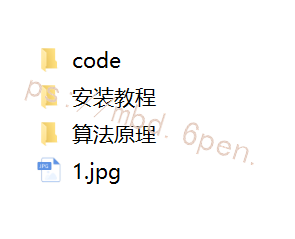

# 1.图片识别

## 识别结果输出TXT文档


# 2.实时识别


# 3.视频展示
[手把手带你构建OCR网络＆火车票识别(完整源码)_哔哩哔哩_bilibili](https://www.bilibili.com/video/BV1Ft4y1J7RF/?vd_source=bc9aec86d164b67a7004b996143742dc)


# 4.CRNN+CTC文本识别网络构建
首先CNN提取图像卷积特征
然后LSTM进一步提取图像卷积特征中的序列特征
[参考该博客引入CTC解决训练时字符无法对齐的问题](https://mbd.pub/o/bread/Yp6cmJtw)


一般情况下对一张图像中的文字进行识别需要以下步骤：

定位文稿中的图片，表格，文字区域，区分文字段落（版面分析）
进行文本行识别（识别）
使用NLP相关算法对文字识别结果进行矫正（后处理）
整个CRNN网络可以分为三个部分：

假设输入图像大小为 ，注意提及图像都是  形式。

Convlutional Layers
这里的卷积层就是一个普通的CNN网络，用于提取输入图像的Convolutional feature maps，即将大小为  的图像转换为  大小的卷积特征矩阵，网络细节请参考本文给出的实现代码。

Recurrent Layers
这里的循环网络层是一个深层双向LSTM网络，在卷积特征的基础上继续提取文字序列特征。
在CRNN中显然使用了第二种stack形深层双向结构。
由于CNN输出的Feature map是大小，所以对于RNN最大时间长度  （即有25个时间输入）。

Transcription Layers
将RNN输出做softmax后，为字符输出。
对于Recurrent Layers，如果使用常见的Softmax cross-entropy loss，则每一列输出都需要对应一个字符元素。那么训练时候每张样本图片都需要标记出每个字符在图片中的位置，再通过CNN感受野对齐到Feature map的每一列获取该列输出对应的Label才能进行训练，如图9。
在实际情况中，标记这种对齐样本非常困难（除了标记字符，还要标记每个字符的位置），工作量非常大。另外，由于每张样本的字符数量不同，字体样式不同，字体大小不同，导致每列输出并不一定能与每个字符一一对应。

整个CRNN的流程如图。先通过CNN提取文本图片的Feature map，然后将每一个channel作为  的时间序列输入到LSTM中。


详细教程参考：
[一文读懂CRNN+CTC文字识别 - 知乎 (zhihu.com)](https://afdian.net/item?plan_id=b695bc425e5d11ed8ac052540025c377)

# 5.代码实现
```
import cv2
from math import *
import numpy as np
from detect.ctpn_predict import get_det_boxes
from recognize.crnn_recognizer import PytorchOcr
recognizer = PytorchOcr()

def dis(image):
    cv2.imshow('image', image)
    cv2.waitKey(0)

def sort_box(box):
    """
    对box进行排序
    """
    box = sorted(box, key=lambda x: sum([x[1], x[3], x[5], x[7]]))
    return box

def dumpRotateImage(img, degree, pt1, pt2, pt3, pt4):
    height, width = img.shape[:2]
    heightNew = int(width * fabs(sin(radians(degree))) + height * fabs(cos(radians(degree))))
    widthNew = int(height * fabs(sin(radians(degree))) + width * fabs(cos(radians(degree))))
    matRotation = cv2.getRotationMatrix2D((width // 2, height // 2), degree, 1)
    matRotation[0, 2] += (widthNew - width) // 2
    matRotation[1, 2] += (heightNew - height) // 2
    imgRotation = cv2.warpAffine(img, matRotation, (widthNew, heightNew), borderValue=(255, 255, 255))
    pt1 = list(pt1)
    pt3 = list(pt3)

    [[pt1[0]], [pt1[1]]] = np.dot(matRotation, np.array([[pt1[0]], [pt1[1]], [1]]))
    [[pt3[0]], [pt3[1]]] = np.dot(matRotation, np.array([[pt3[0]], [pt3[1]], [1]]))
    ydim, xdim = imgRotation.shape[:2]
    imgOut = imgRotation[max(1, int(pt1[1])): min(ydim - 1, int(pt3[1])),
             max(1, int(pt1[0])): min(xdim - 1, int(pt3[0]))]

    return imgOut


def charRec(img, text_recs, adjust=False):
    """
    加载OCR模型，进行字符识别
    """
    results = {}
    xDim, yDim = img.shape[1], img.shape[0]

    for index, rec in enumerate(text_recs):
        xlength = int((rec[6] - rec[0]) * 0.1)
        ylength = int((rec[7] - rec[1]) * 0.2)
        if adjust:
            pt1 = (max(1, rec[0] - xlength), max(1, rec[1] - ylength))
            pt2 = (rec[2], rec[3])
            pt3 = (min(rec[6] + xlength, xDim - 2), min(yDim - 2, rec[7] + ylength))
            pt4 = (rec[4], rec[5])
        else:
            pt1 = (max(1, rec[0]), max(1, rec[1]))
            pt2 = (rec[2], rec[3])
            pt3 = (min(rec[6], xDim - 2), min(yDim - 2, rec[7]))
            pt4 = (rec[4], rec[5])

        degree = degrees(atan2(pt2[1] - pt1[1], pt2[0] - pt1[0]))  # 图像倾斜角度

        partImg = dumpRotateImage(img, degree, pt1, pt2, pt3, pt4)
        # dis(partImg)
        if partImg.shape[0] < 1 or partImg.shape[1] < 1 or partImg.shape[0] > partImg.shape[1]:  # 过滤异常图片
            continue
        text = recognizer.recognize(partImg)
        if len(text) > 0:
            results[index] = [rec]
            results[index].append(text)  # 识别文字

    return results

def ocr(image):
    # detect
    text_recs, img_framed, image = get_det_boxes(image)
    text_recs = sort_box(text_recs)
    result = charRec(image, text_recs)
    return result, img_framed
```
# 6.系统整合
下图[源码＆环境部署教程](https://s.xiaocichang.com/s/12e92c)


参考博客[《Python原创OCR算法＆轻量部署＆火车票识别\[源码＆非PaddleOCR＆技术原理＆部署教程\]》](https://mbd.pub/o/qunma/work)
# 7.参考文献：
* * *

1.  Shi, B., Bai, X., & Yao, C. (2016). An end-to-end trainable neural network for image-based sequence recognition and its application to scene text recognition. IEEE transactions on pattern analysis and machine intelligence, 39(11), 2298-2304.[↩︎](https://whuran.github.io/2021/12/31/text-recognition/#fnref1)

2.  Fedor Borisyuk, Albert Gordo, and Viswanath Sivakumar. Rosetta: Large scale system for text detection and recognition in images. In Proceedings of the 24th ACM SIGKDD International Conference on Knowledge Discovery & Data Mining, pages 71–79\. ACM, 2018.[↩︎](https://whuran.github.io/2021/12/31/text-recognition/#fnref2)

3.  Gao, Y., Chen, Y., Wang, J., & Lu, H. (2017). Reading scene text with attention convolutional sequence modeling. arXiv preprint arXiv:1709.04303.[↩︎](https://whuran.github.io/2021/12/31/text-recognition/#fnref3)

4.  Shi, B., Wang, X., Lyu, P., Yao, C., & Bai, X. (2016). Robust scene text recognition with automatic rectification. In Proceedings of the IEEE conference on computer vision and pattern recognition (pp. 4168-4176).[↩︎](https://whuran.github.io/2021/12/31/text-recognition/#fnref4)

5.  Baoguang Shi, Mingkun Yang, XingGang Wang, Pengyuan Lyu, Xiang Bai, and Cong Yao. Aster: An attentional scene text recognizer with flexible rectification. IEEE transactions on pattern analysis and machine intelligence, 31(11):855–868, 2018.[↩︎](https://whuran.github.io/2021/12/31/text-recognition/#fnref5)

6.  Star-Net Max Jaderberg, Karen Simonyan, Andrew Zisserman, et al. Spatial transformer networks. In Advances in neural information processing systems, pages 2017–2025, 2015.[↩︎](https://whuran.github.io/2021/12/31/text-recognition/#fnref6)

7.  Lee C Y , Osindero S . Recursive Recurrent Nets with Attention Modeling for OCR in the Wild[C]// IEEE Conference on Computer Vision & Pattern Recognition. IEEE, 2016.[↩︎](https://whuran.github.io/2021/12/31/text-recognition/#fnref7)

8.  Li, H., Wang, P., Shen, C., & Zhang, G. (2019, July). Show, attend and read: A simple and strong baseline for irregular text recognition. In Proceedings of the AAAI Conference on Artificial Intelligence (Vol. 33, No. 01, pp. 8610-8617).[↩︎](https://whuran.github.io/2021/12/31/text-recognition/#fnref8)

9.  P. Lyu, C. Yao, W. Wu, S. Yan, and X. Bai. Multi-oriented scene text detection via corner localization and region segmentation. In Proc. CVPR, pages 7553–7563, 2018.[↩︎](https://whuran.github.io/2021/12/31/text-recognition/#fnref9)

10.  Liao, M., Zhang, J., Wan, Z., Xie, F., Liang, J., Lyu, P., ... & Bai, X. (2019, July). Scene text recognition from two-dimensional perspective. In Proceedings of the AAAI Conference on Artificial Intelligence (Vol. 33, No. 01, pp. 8714-8721).[↩︎](https://whuran.github.io/2021/12/31/text-recognition/#fnref10)

11.  Yu, D., Li, X., Zhang, C., Liu, T., Han, J., Liu, J., & Ding, E. (2020). Towards accurate scene text recognition with semantic reasoning networks. In Proceedings of the IEEE/CVF Conference on Computer Vision and Pattern Recognition (pp. 12113-12122).[↩︎](https://whuran.github.io/2021/12/31/text-recognition/#fnref11)

12.  Sheng, F., Chen, Z., & Xu, B. (2019, September). NRTR: A no-recurrence sequence-to-sequence model for scene text recognition. In 2019 International Conference on Document Analysis and Recognition (ICDAR) (pp. 781-786). IEEE.[↩︎](https://whuran.github.io/2021/12/31/text-recognition/#fnref12)

13.  Yang, L., Wang, P., Li, H., Li, Z., & Zhang, Y. (2020). A holistic representation guided attention network for scene text recognition. Neurocomputing, 414, 67-75.[↩︎](https://whuran.github.io/2021/12/31/text-recognition/#fnref13)

14.  Wang, Y., Xie, H., Fang, S., Wang, J., Zhu, S., & Zhang, Y. (2021). From two to one: A new scene text recognizer with visual language modeling network. In Proceedings of the IEEE/CVF International Conference on Computer Vision (pp. 14194-14203).[↩︎](https://whuran.github.io/2021/12/31/text-recognition/#fnref14)

15.  Li, H., Wang, P., Shen, C., & Zhang, G. (2019, July). Show, attend and read: A simple and strong baseline for irregular text recognition. In Proceedings of the AAAI Conference on Artificial Intelligence (Vol. 33, No. 01, pp. 8610-8617).[↩︎](https://whuran.github.io/2021/12/31/text-recognition/#fnref15)

16.  Canjie, L., Yuanzhi, Z., & Lianwen, J. (2020). Yongpan Wang2Learn to Augment: Joint Data Augmentation and Network Optimization for Text Recognition.[↩︎](https://whuran.github.io/2021/12/31/text-recognition/#fnref16)


---
#### 如果您需要更详细的【源码和环境部署教程】，除了通过【系统整合】小节的链接获取之外，还可以通过邮箱以下途径获取:
#### 1.请先在GitHub上为该项目点赞（Star），编辑一封邮件，附上点赞的截图、项目的中文描述概述（About）以及您的用途需求，发送到我们的邮箱
#### sharecode@yeah.net
#### 2.我们收到邮件后会定期根据邮件的接收顺序将【完整源码和环境部署教程】发送到您的邮箱。
#### 【免责声明】本文来源于用户投稿，如果侵犯任何第三方的合法权益，可通过邮箱联系删除。